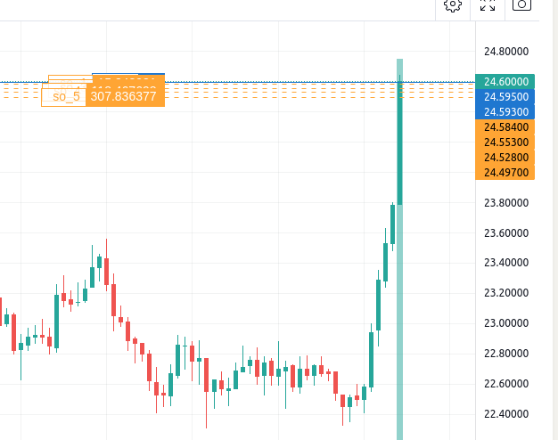

# Autotrade

## Restrictions
- Autotrade doesn't work with fiat currencies at the moment. It assumes GBP as main conversion fiat and uses it for hedging, but apart from that, Binance also allows trading with currencies such as Australian dollar (AUD), American dollar (USD), CNY (Chinese yuan) etc... which are skipped in the algo (research/__init__.py, skipped_fiat_currencies) on top of the blacklist cryptocurrencies, which are more specific cases.
- Autotrade checks for global settings from research_controller
- Autotrade checks for availability of balance
- Autotrade checks for existent active bots, to avoid creating the same bot


## handle_price_drops
This is an improved version of `default_5_so`. Arguments:

- per_deviation. Percentage deviation is the mathemtical component in the threshold that spreads prices to protect the investment. This is the independent variable that causes the dependeant variable to change (threshold)
- total_num_so. Total number of Safety orders, this is dependant on existing funds, set as 3 as the reasonable trade off between balance funds and protection.
- exp_increase. Mathematical algorithmic approximation of trade.
- trend. `upward` or `downward` trends help apply different strategies depending on estimated direction of prices.

By default, it uses safety orders as a safety net for bounces. So if prices goes up and then down and then up again, this will reduce average cost, and if it goes up after the bounce, the increased price will be leveraged by the increased possession of that crypto/token.

If trend is `downward`, safety orders will be **skipped**. Mainly because a signal, such as panic signal from hoodloo, will likely signal a downward trend, so wasting money in buying back following QFL's system will not work, the prices will keep dropping, the total value of the portfolio could be highly affected after a 5-10% drop, and time is wasted as well, better buy another crypto/coin meanwhile and short this one.
### Dynamic price_deviation

An update to include a dynamic price deviation was tested, it did not work well with candlestick_jump algorithm, because sudden movement in the markets do not change the volatility completely, therefore yielding a standard deviation which is quite low compared to the spread of the price.

As a result it created very tight, close safety orders, which is not useful as safety net for falling prices.



Original code on autotrade.py -> activate_autotrade:

```python
if "sd" in kwargs:
    spread = ((kwargs["sd"] * 2) / self.default_bot["deal"]["buy_price"])
    self.default_bot["trailling_deviation"] = float(spread * 100)
        self.default_5_so(balances, base_order_price, per_deviation=(spread))
    else:
        self.default_5_so(balances, base_order_price)

```

However it is a good strategy for trailling profit.

Further research is required to do dynamic SOs


### Trends
Trends in autotrade can be two values only: `downtrend` or `uptrend` (any value)