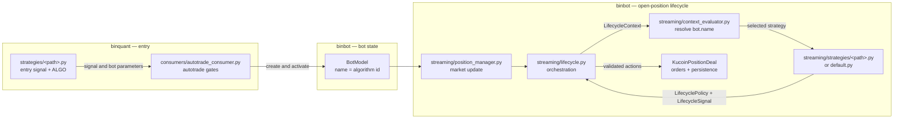

# Position lifecycle architecture

The position lifecycle starts after an entry strategy has created and activated a
bot. Entry selection belongs to **binquant**; management of the open position
belongs to **binbot**.

This boundary keeps two different decisions separate:

- A binquant entry strategy decides **when to enter**, which symbol and direction
  to trade, and the initial bot parameters.
- A binbot lifecycle strategy decides **how an open position behaves**, including
  dynamic stop and trailing parameters, maximum holding time, reversal policy,
  and strategy-specific exits.

Lifecycle strategies describe intent. They do not place orders or write directly
to the database. `Lifecycle` applies their result through the shared execution
layer so exchange and persistence behaviour stays centralized.

## High-level flow

The algorithm id is the cross-repository contract. Binquant writes it to
`BotModel.name`; `LifecycleContextEvaluator` reads that name and selects the
registered lifecycle strategy.

## Entry-to-lifecycle matching contract

Every binquant entry strategy that can create a standard bot must have a
**deliberate lifecycle mapping** in binbot. There are two valid mappings:

1. A dedicated lifecycle strategy when the entry thesis needs custom management.
2. An explicit, tested decision to use `DefaultLifecycleStrategy` when the shared
   behaviour is sufficient.

Accidental fallback is not a lifecycle design. A new autotrading entry strategy
must not be enabled until its lifecycle mapping has been chosen and tested.

When a dedicated lifecycle strategy exists, it mirrors the binquant entry
strategy's relative path:

| Entry strategy in binquant | Lifecycle strategy in binbot |
| --- | --- |
| `strategies/mean_reversion_fade.py` | `streaming/strategies/mean_reversion_fade.py` |
| `strategies/coinrule/price_tracker.py` | `streaming/strategies/coinrule/price_tracker.py` |

The match has three parts:

- The files use the same relative strategy path and name.
- The binquant strategy's `ALGO` value matches one of the binbot lifecycle
  strategy's `algorithm_names` values exactly.
- The lifecycle class is included in `LifecycleContextEvaluator.STRATEGY_TYPES`.

The reverse rule also applies: every dedicated module under
`streaming/strategies/` must represent an existing binquant entry strategy.
Lifecycle-only strategy names and orphaned files should be removed.

The following files are framework code and do not need binquant counterparts:

- `streaming/strategies/base.py`
- `streaming/strategies/default.py`
- package `__init__.py` files

Grid ladders also sit outside this mapping because they use their own lifecycle
and persistence model rather than the standard bot lifecycle.

## File responsibilities

| File | Responsibility |
| --- | --- |
| `binquant/strategies/<path>.py` | Detects an entry and emits the stable algorithm id and initial bot parameters. |
| `binquant/consumers/autotrade_consumer.py` | Applies entry gates and creates or activates the bot through the binbot API. |
| `streaming/position_manager.py` | Receives a market update, loads the active bot, and starts a lifecycle tick. |
| `streaming/lifecycle.py` | Builds market context, applies strategy output, and owns the common position state machine. |
| `streaming/context_evaluator.py` | Resolves `BotModel.name` to a lifecycle strategy and contains strategy failures. |
| `streaming/strategies/base.py` | Defines the context, policy, signal, exit intent, and shared helpers. |
| `streaming/strategies/default.py` | Supplies common dynamic stop and trailing behaviour and is the intentional fallback. |
| `streaming/strategies/<path>.py` | Expresses only the lifecycle differences required by one entry strategy. |
| `api/exchange_apis/kucoin/futures/futures_deal.py` | Performs exchange operations and persists the resulting bot state. |

## Strategy input and output

`Lifecycle` builds one `LifecycleContext` for the current tick. It includes the
validated bot, current price, candle data, timing, Bollinger-band metrics,
current profit, and whether an exchange stop is live.

A lifecycle strategy returns a `LifecycleSignal` and exposes a
`LifecyclePolicy`:

- `LifecycleSignal.parameter_update` proposes stop-loss and trailing changes.
- `LifecycleSignal.exit_intent` requests an algorithmic close, such as a maximum
  holding-period exit.
- `LifecycleSignal.log_messages` explains decisions that should be persisted.
- `LifecyclePolicy` controls shared lifecycle branches such as low-price stop
  floors, emergency stop bounds, and reversal blocking.

`Lifecycle` remains responsible for applying those declarations in the correct
order. The strategy module must not call exchange APIs, mutate persistence, or
duplicate the common stop, trailing, and recovery state machine.

## Adding or changing an entry strategy

When an entry strategy is added or renamed:

1. Choose one stable algorithm id and preserve it from the binquant signal through
   `BotModel.name`.
2. Decide whether the standard lifecycle is sufficient.
3. If custom behaviour is required, add the matching relative module under
   `streaming/strategies/`, declare its `algorithm_names`, and register it in
   `LifecycleContextEvaluator.STRATEGY_TYPES`.
4. Add a resolution test plus focused tests for every custom policy, parameter
   update, and exit intent.
5. Check both repositories for orphaned entry or lifecycle names before enabling
   autotrade.

The intended result is a traceable pair: the entry thesis explains why a trade
was opened, and its lifecycle mapping explains how that trade will be managed
until it closes.
